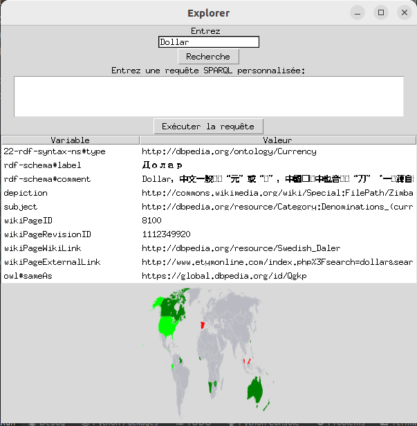
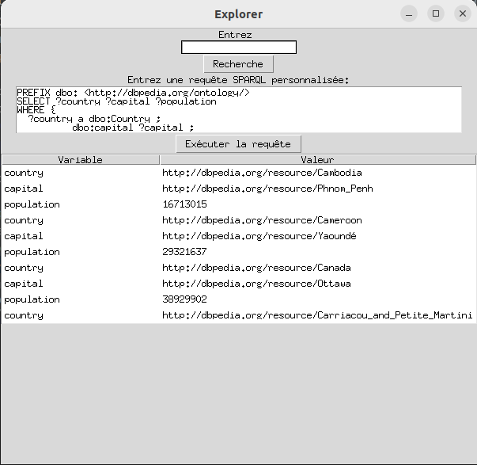
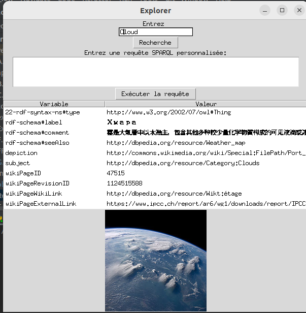

# "Python DBpedia: Exploiting Potential"

## Exploring the Potential of DBpedia: Python SPARQL for Database Interaction
The DBpedia project represents a vast graph of multilingual knowledge
which gathers structured information extracted from Wikipedia. This report aims to
to present the methods of interaction with DBpedia databases in
using Python SPARQL. Thanks to this acquired knowledge, it becomes possible
leverage the power of DBpedia to improve projects and re-
Conducted searches.

#TEST

## Test

